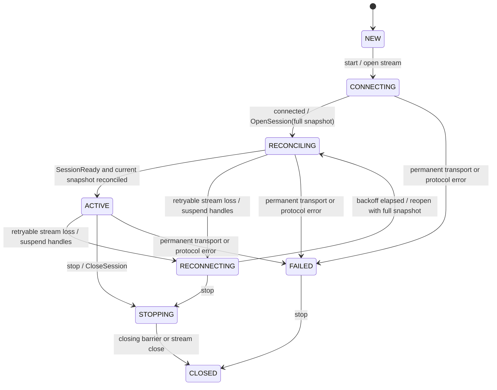
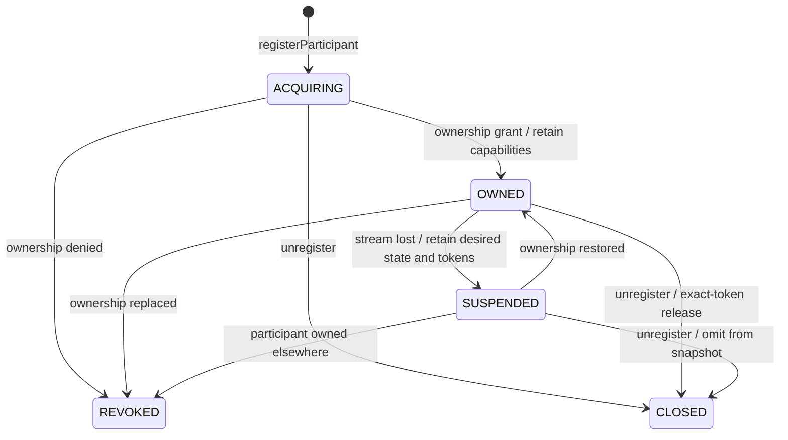

# Reference: lifecycles

> Background material. A working integration does not require this page.
> [Participants](participants.md) describes the same states in application
> terms.

`ControllerSession` owns the complete local desired state of one controller
instance. Participants and observations may be registered before `start()`;
they are included in the first `OpenSession` snapshot.

## Session lifecycle



`ACTIVE` requires both `SessionReady` and a reconciliation barrier covering the
current desired-state revision. Transport keepalive never renews the business
lease. A reconnect sends a full snapshot before incremental commands resume.

## Participant lifecycle



`REVOKED` and `CLOSED` are terminal for a handle. Reacquisition creates a new
handle with a new registration identity.

While suspended, repeated `setSpec` calls retain only the newest full
specification for transport. Futures for earlier revisions complete when Rust
accepts a revision covering them.

## Joining Mumble

The ownership grant also supplies a `ConnectionCredential`. It is available through:

```java
participant.whenConnectionCredentialAvailable()
    .thenAccept(token -> givePasswordToPlayer(token.value()));
```

`connectionCredential()` returns the current value synchronously. A valid resume
keeps it; a reacquisition may rotate it and invokes
`ParticipantListener.onConnectionCredentialChanged`. Revocation and local
unregistration remove it. Its `toString()` representation is always redacted.

The join token and the internal ownership token are deliberately different:
sharing a Mumble password must never grant the ability to update or release the
participant.

## Space reads

`observeSpace` and `unobserveSpace` replace the complete explicit observation
set. Streamed `SpaceSnapshot` values replace the cached incarnation and
revision. `fetchSpace` returns a point-in-time result without changing the
cache or future observations.

The generated [Java API documentation](https://theking90000.github.io/mumble-server-runtime/controller/)
contains the complete public surface.
