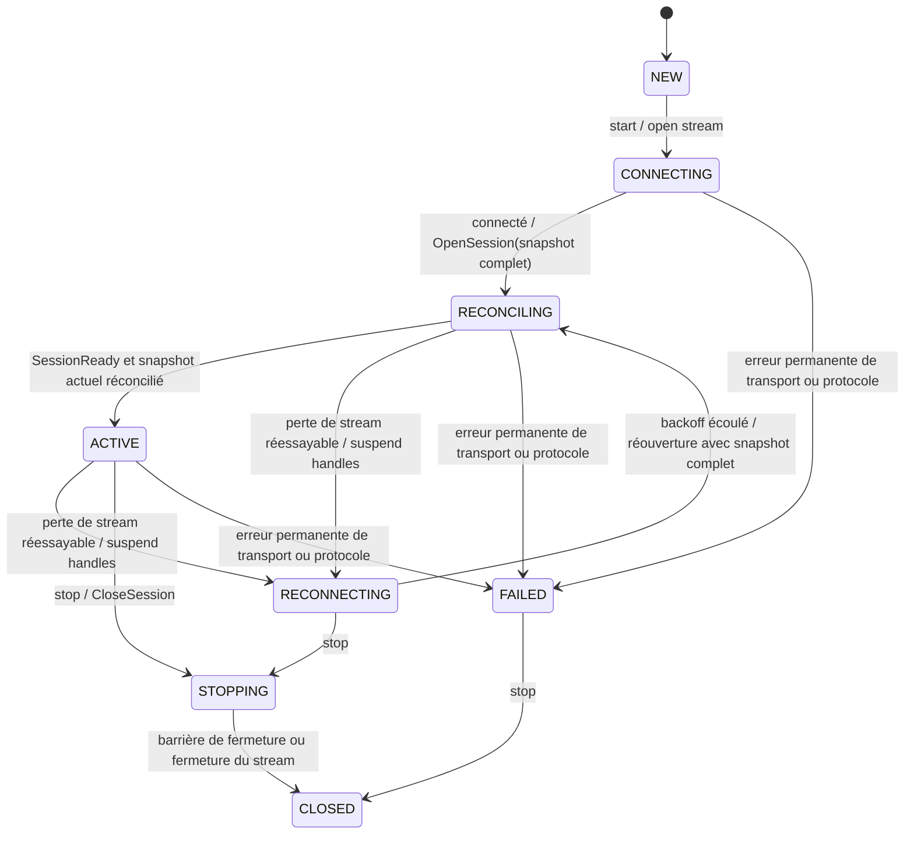
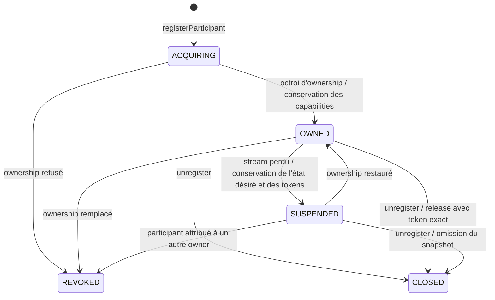

# Référence : cycles de vie

> Background. Une intégration fonctionnelle ne nécessite pas la lecture de cette page.
> La page [Participants](participants.md) décrit les mêmes états sous un angle applicatif.

`ControllerSession` détient l'intégralité de l'état désiré local d'une instance de controller. Les participants et les observations peuvent être enregistrés avant l'appel à `start()` ; ils sont inclus dans le premier snapshot lors d' `OpenSession`.

## Cycle de vie d'une Session



L'état `ACTIVE` nécessite à la fois l'événement `SessionReady` et une barrière de réconciliation couvrant la révision courante de l'état désiré. Le keepalive au niveau du transport ne renouvelle pas le lease métier. Toute ré-connexion transmet un snapshot complet avant la reprise de l'émission des commandes incrémentales.

## Cycle de vie d'un Participant



Les états `REVOKED` et `CLOSED` sont terminaux pour un handle. Toute ré-acquisition nécessite la création d'un nouveau handle avec un nouvel identifiant d'enregistrement.

Durant l'état `SUSPENDED`, les appels successifs à `setSpec` ne conservent que la spécification complète la plus récente en vue de sa transmission. Les futures associés aux révisions antérieures se complètent lorsque Rust valide une révision englobant ces dernières.

## Rejoindre Mumble

L'octroi de l'ownership fournit également un `MumbleJoinToken`, accessible via :

```java
participant.whenMumbleJoinTokenAvailable()
    .thenAccept(token -> givePasswordToPlayer(token.value()));
```

La méthode `mumbleJoinToken()` retourne la valeur courante de manière synchrone. Une reconnexion valide (resume) le conserve ; une ré-acquisition peut entraîner une rotation et déclenche `ParticipantListener.onMumbleJoinTokenChanged`. La révocation et l'unregister local le suppriment. Sa représentation via `toString()` est systématiquement masquée (redacted).

Le join token et le token d'ownership interne sont volontairement distincts : la transmission d'un mot de passe Mumble ne doit en aucun cas accorder la capacité de modifier ou de libérer le participant.

## Lectures de Space

Les méthodes `observeSpace` et `unobserveSpace` remplacent l'ensemble des observations explicites. Les valeurs de `SpaceSnapshot` reçues en streaming remplacent l'incarnation et la révision conservées en cache. `fetchSpace` retourne un résultat ponctuel à un instant T sans modifier le cache ni les observations futures.

La [documentation de l'API Java](https://theking90000.github.io/mumble-server-runtime/controller/) générée contient la description complète de la surface publique.
