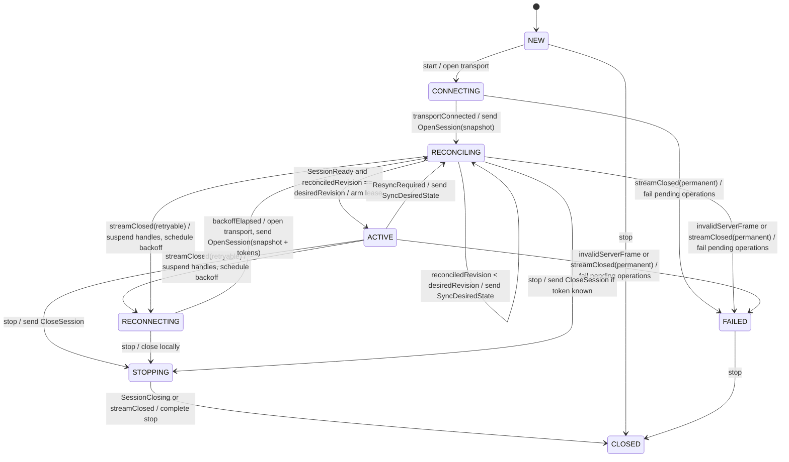
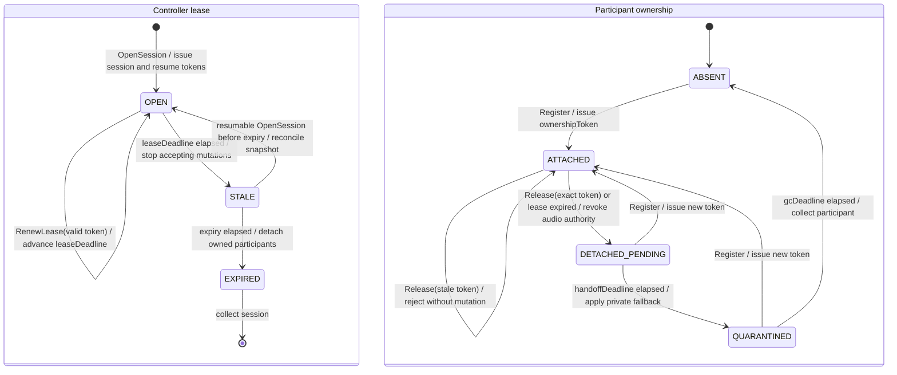

# Controller integration state machines

This document specifies the controller contract implemented by
`integrations/controller/sdk-java`. The Mermaid diagrams replace the earlier
Minecraft-specific Itemis drafts. They describe three orthogonal machines; no
generated state-machine runtime participates in the Java build.

## ControllerSession

Variables:

- `desiredRevision`: revision of the complete local desired state;
- `reconciledRevision`: latest revision acknowledged by Rust;
- `sessionToken`, `resumeToken`: opaque server-issued capabilities;
- `leaseDuration`: server-selected business lease duration;
- `attempt`: reconnect backoff attempt.



Safety invariants:

- `ACTIVE` requires both `SessionReady` and a reconciliation barrier for the
  current `desiredRevision`;
- transport keepalive never renews the business lease;
- a reconnect always sends a full snapshot before incremental commands resume;
- receipt of a client frame never advances applied or published watermarks.

## ParticipantHandle

Variables:

- `registrationId`: stable idempotency key for this handle;
- `ownershipToken`: current Rust-issued fencing capability, possibly empty;
- `clientSpecRevision`: local monotonic desired-state revision;
- `acceptedClientSpecRevision`: latest revision covered by a Rust response;
- `desiredSpec`: last full participant spec.

```mermaid
stateDiagram-v2
    [*] --> ACQUIRING: registerParticipant / add to desired snapshot
    ACQUIRING --> OWNED: OwnershipGranted(registrationId) / retain token, complete whenOwned
    ACQUIRING --> REVOKED: OwnershipRevoked or Register rejected / remove desired registration
    ACQUIRING --> CLOSED: unregister / omit from next snapshot
    OWNED --> SUSPENDED: streamClosed / retain token and coalesce setSpec
    SUSPENDED --> OWNED: OwnershipGranted(same registrationId) / complete covered futures
    SUSPENDED --> REVOKED: token refused and participant already owned / fail pending futures
    OWNED --> REVOKED: OwnershipRevoked or OWNERSHIP_LOST / fail pending futures, remove desired registration
    OWNED --> CLOSED: unregister / send Release(token)
    SUSPENDED --> CLOSED: unregister / omit from snapshot, release after reconnect if required
    CLOSED --> CLOSED: stale Release acknowledgement / no effect on another registration
```



Safety invariants:

- only an exact current token may mutate or release a participant;
- `registrationId`, not a retry count, makes acquisition idempotent;
- `setSpec` replaces the complete spec and keeps only the newest wire state while
  all futures up to its revision complete from the covering acknowledgement;
- `REVOKED` is terminal. Re-acquisition creates a new handle and registration id;
- a revocation naming another registration id cannot change this handle.

## ControllerLeaseAndOwnership

Server-side variables specified by the contract, for the future Rust adapter:

- `leaseDeadline` per controller session;
- `currentToken[participant]` and `currentRegistration[participant]`;
- `handoffDeadline[participant]` and `gcDeadline[participant]`;
- `explicitObservedSpaces[session]`.



The effective read interest is always:

```text
explicitObservedSpaces(session)
union Spaces containing a participant currently owned by session
```

`ReplaceObservedSpaces` replaces only the explicit set. `FetchSpace` is a
one-shot read and never changes either side of this union.

## Required trace scenarios

The Java reducer tests cover connection barriers, reconnect snapshots, offline
coalescing, revocation, full observation replacement, one-shot fetches, space
incarnations, stale registration messages, and idempotent shutdown. The future
Rust adapter must additionally verify both reordered handoff traces:

1. `Release(old)` then `Register(new)` enters `DETACHED_PENDING` briefly and ends
   attached to the new token.
2. `Register(new)` then `Release(old)` remains attached to the new token because
   the stale release fails its exact-token guard.
